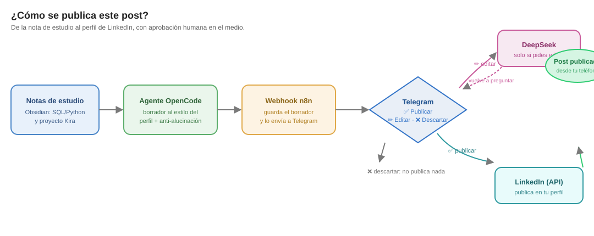
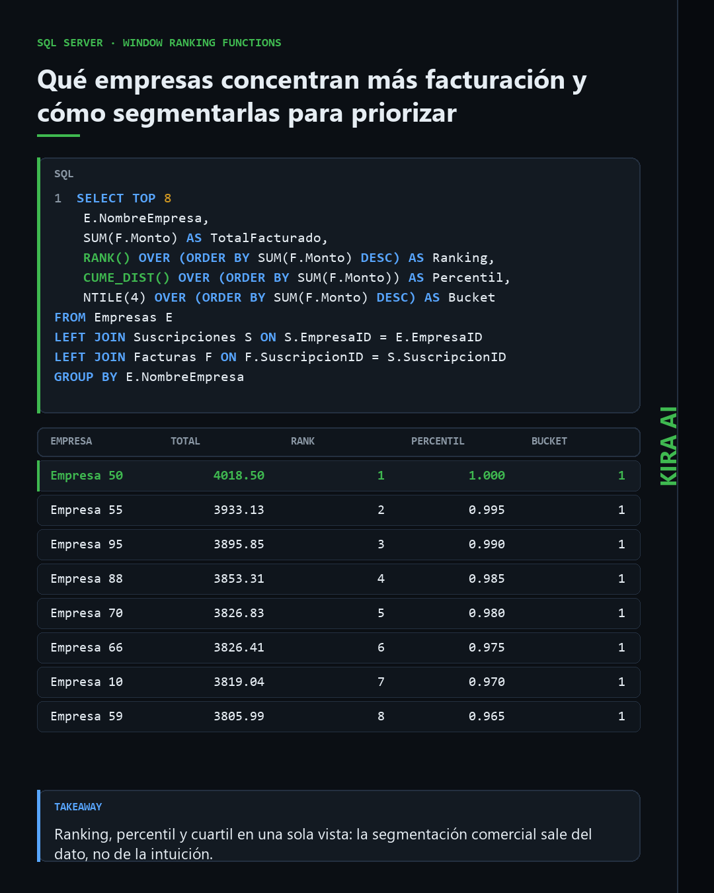
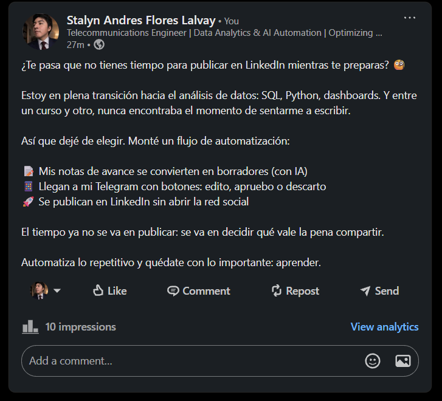
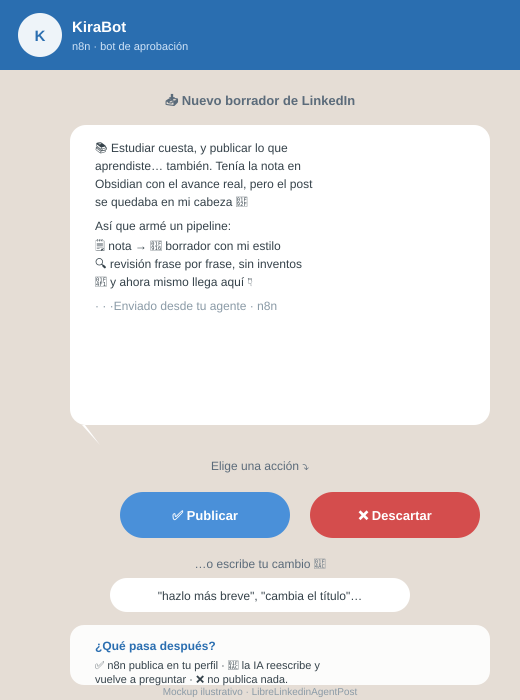
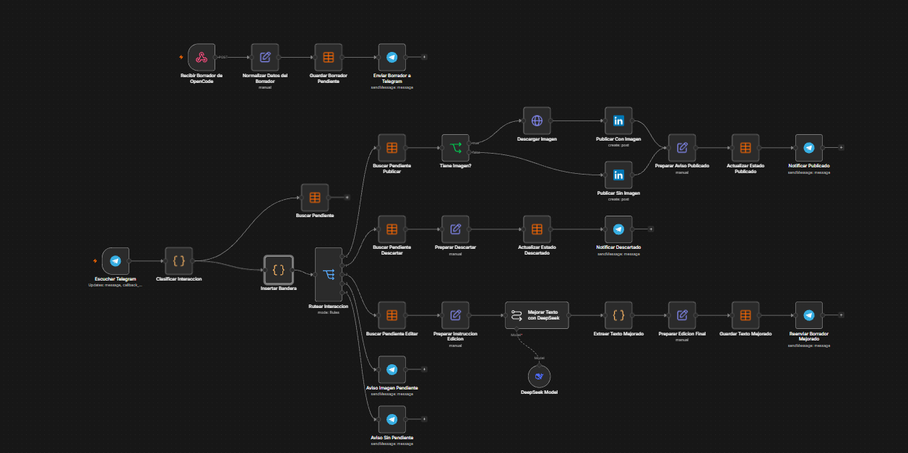

# LinkedinAgentPost

Pipeline **open source** para publicar en LinkedIn desde tus notas: un
agente de OpenCode redacta el borrador a partir de tu Obsidian (con verificación
anti-alucinación), genera la imagen del post, y un webhook de n8n lo guarda y, desde
**Telegram**, lo editas, descartas o **publicas con un toque**.

[](LICENSE)

> Ejemplo real en producción, construido por un analista de datos que trabaja con
> SQL/Python y proyectos de IA **Kira** — y publica en LinkedIn sin que la redacción
> le robe tiempo.

---

## Qué resuelve

El problema real: estudias, avanzas, y el paso de "tengo mi nota" a "lo publiqué en
LinkedIn" nunca llega. Redactar toma 30+ minutos, revisar que nada esté inventado toma
más, y al final el post se queda en el borrador mental.

Este proyecto automatiza lo repetitivo y te deja **a ti** la única decisión que importa:
**¿publico o no?**

1. El plugin detecta (al quedar tu sesión ociosa) que hay notas nuevas con avance real
   de estudio o del proyecto.
2. El agente `linkedin_agent` orquesta: el subagente `linkedin-drafter` redacta siguiendo
   la skill `linkedin-post-style` (reglas de tono estrictas), y el subagente
   `linkedin-fact-checker` compara el borrador contra la nota **frase por frase**:
   cualquier dato sin respaldo textual se marca, nunca se inventa.
3. El borrador aterriza en tu Telegram con dos botones y la invitación a escribir:
   **✅ Publicar · ❌ Descartar · 💬 escribe cualquier cambio**.
4. **✅ Publicar** → n8n lo publica en tu perfil. **Escribir en el chat** → DeepSeek lo
   reescribe a tu pedido y vuelve a pedir aprobación (misma tarjeta, actualizada).
   **❌ Descartar** → no publica nada.

Un detalle que importa: si no hay ningún borrador pendiente y aun así respondes,
el flujo **te avisa en vez de quedarse en silencio** (fue un bug real de la primera
versión: la cadena de n8n moría callada).

## Cómo funciona

Alto nivel: de la nota de estudio al perfil, con aprobación humana en el medio.



**OpenCode:** el orquestador solo coordina. Redacta el `linkedin-drafter` (que solo
escribe en `linkedin-drafts/` y carga la skill obligatoria `linkedin-post-style`),
verifica el `linkedin-fact-checker` (solo lectura, responde `VEREDICTO: OK` o una lista
de frases sin respaldo), y recién con el veredicto OK envía el borrador al webhook con
permiso `ask`. Nunca llama a la API de LinkedIn directamente.

**n8n:** el webhook recibe el borrador, lo persiste como `pendiente` en una data table
(cola de aprobación), y le manda a Telegram el texto con botones ✅/❌ e indicación de que
puede **escribir** para pedir una edición. El `telegramTrigger` captura botones y mensajes
de texto: clasifica la interacción (`publicar | editar | descartar`), una sonda paralela
revisa la cola y, si no hay pendiente, avisa en vez de morir en silencio; si hay
pendiente, cada rama actúa. La edición reescribe con DeepSeek, guarda la nueva versión en
la cola y vuelve a pedir aprobación; la publicación usa el nodo LinkedIn con
`postAs: person` y `visibility: PUBLIC`. Todos los nodos Telegram usan
`parseMode: 'None'`: el texto del post es plano y parsearlo rompe el envío.

## La imagen: dark, generada por el agente

La imagen del post no es una captura del usuario: la genera el propio agente con
`scripts/generar-imagen-post.py`, y siempre con el mismo diseño.

- Lienzo 1080x1350 (4:5), tema dark.
- Pregunta de negocio arriba, panel SQL con resaltado, grilla con **resultados reales**
  (el query se ejecuta, no se inventa), caja de takeaway.
- Firma `KIRA AI` en la barra lateral vertical, siempre en el mismo lugar.

```bash
python scripts/generar-imagen-post.py --config post.json --out assets/screenshots/mi-post.png
```

El `imageUrl` que viaja al workflow es la URL `raw.githubusercontent.com` de esa imagen, y
la imagen se sube a GitHub **antes** de llamar al webhook: n8n la descarga desde esa URL y
responde 404 si el archivo todavía no está publicado.



## Capturas en vivo

_Pega aquí tus capturas reales del flujo en acción._

> ⛳ **Slots editables.** Guarda tus capturas en `assets/screenshots/` y reemplaza o añade
> líneas `` abajo con el `src` correcto. El mockup de Telegram y el diagrama se
> generan del propio repo (`assets/*.svg`) y se actualizan solos.

| Captura | Qué muestra |
| ------- | ----------- |
| <br/><sub><i>El post publicado en LinkedIn</i></sub> | Resultado final: la publicación ya subida al perfil. |
| <br/><sub><i>Mockup: el borrador llega a tu Telegram</i></sub> | Cómo se ve la aprobación: texto + botones **✅ Publicar · ❌ Descartar** y aviso de que puedes escribir para editar. |
| <br/><sub><i>Flujo de n8n</i></sub> | El workflow de n8n que decide la rama según tu elección. |

## Resultados reales

- Probado de punta a punta contra una instancia n8n real y la API de LinkedIn: el
  primer post del flujo se publicó en el perfil auténtico (ver captura de arriba).
- El borrador se manda desde el agente (sin abrir el editor) y se aprueba/edita
  **desde el teléfono**.
- Aprobación, edición y descarte registrados; cada interacción responde (incluido el
  aviso de "no hay pendientes").

### Así llega el mensaje a tu Telegram

1. Tu agente manda el borrador al webhook de n8n (`POST /linkedin-draft-v2`).
2. n8n lo guarda en la data table como `pendiente` y el bot de Telegram te lo envía
   con los botones **✅ Publicar · ❌ Descartar** y la invitación a escribir un cambio.
3. Tú respondes desde el móvil: pulsas un botón o **escribes** el cambio; el
   `telegramTrigger` lo captura y n8n decide la rama.
4. El flujo siempre responde: publicado, reescrito pendiente de re-aprobación, o aviso
   de "no hay pendientes".

## Estructura del repositorio

```
LinkedinAgentPost/
├── AGENTS.md                        # flujo y decisiones firmes del pipeline
├── agents/
│   ├── linkedin_agent.md          # orquestador: drafter + fact-checker + imagen + envío
│   ├── linkedin-drafter.md        # redacta desde las notas y fija el query de la imagen
│   └── linkedin-fact-checker.md   # verificación anti-alucinación oración a oración
├── skills/
│   └── linkedin-post-style/       # guía de estilo, texto plano, imagen dark y anti-alucinación
├── plugin/
│   └── linkedin-trigger.ts        # dispara el borrador al quedar la sesión inactiva y valida el formato
├── workflows/
│   └── linkedin-post-v2.template.ts  # plantilla n8n (Workflow SDK) con placeholders
├── scripts/
│   ├── generar-imagen-post.py      # generador de la imagen dark 1080x1350
│   └── scan-secrets.sh            # escáner genérico de secretos (pre-push)
├── assets/
│   ├── diagrama-flujo.svg         # diagrama general
│   ├── telegram-mockup.svg        # mockup del mensaje con botones
│   └── screenshots/               # imágenes de los posts (URL estable por nombre)
├── opencode.json.example          # copia a opencode.json con TU token MCP
├── SECURITY.md
└── LICENSE
```

## Instalación

Prerrequisitos: una instancia de **n8n** (self-hosted o cloud), el **MCP server** de n8n
expuesto por HTTP, un **bot de Telegram**, una app de **LinkedIn** con permiso
`w_member_social`, y una **API key de DeepSeek** (o tu LLM preferido).

1. **Agentes, skill y AGENTS.md.** Copia `agents/*.md` a `~/.config/opencode/agents/`,
   `skills/linkedin-post-style/` a tus skills y `AGENTS.md` a la raíz de tu proyecto
   (ahí queda el flujo y las decisiones que no se negocian).
2. **Plugin.** Instala `plugin/linkedin-trigger.ts` y define las variables de entorno
   (sin rutas reales en el repo):
   ```bash
   export LINKEDIN_PROJECT_DIR="/ruta/a/tu/proyecto-linkedin"
   export LINKEDIN_TRACKED_DIRS="/ruta/al/vault-de-obsidian;/ruta/a/tu/proyecto"
   ```
3. **MCP de n8n para OpenCode.** Crea tu `opencode.json` copiando
   `opencode.json.example` y pega el token de tu instancia.
4. **Workflow de n8n.** Crea la data table (columnas `draftText`, `seccion`, `fecha`,
   `sourceNote`, `veredicto`, `imageUrl`, `chatId`, `estado`) y genera el workflow desde
   `workflows/linkedin-post-v2.template.ts` (n8n → Workflow SDK / importar). Rellena
   todos los `YOUR_*` y conecta las credenciales del bot, de LinkedIn y de DeepSeek a
   sus nodos. El webhook usa **Header Auth**: crea una credencial de ese tipo con el
   header `X-LinkedIn-Key` y un valor aleatorio largo, conéctala al nodo del webhook y
   exporta ese valor como la variable de entorno `LINKEDIN_WEBHOOK_KEY` (es lo único
   que el agente lee para enviar). Sin ese header el webhook responde 403 y nadie más
   puede inyectar borradores en tu cola.
5. **Prueba.** Manda un borrador al webhook `POST /linkedin-draft-v2`
   (`{"draftText": "...", "seccion": "kira", "fecha": "2026-09-13", "chatId": "..."}`)
   y aprueba desde Telegram.

## Seguridad

Este repo es público y solo contiene placeholders (`YOUR_*`), scripts y plantillas.
Jamás subas tokens, rutas personales ni IDs. Corre `./scripts/scan-secrets.sh` antes de
cada push (y activa *secret scanning* + *push protection* en GitHub). Detalles en
[SECURITY.md](SECURITY.md).

## Licencia

MIT © 2026 Stalyn Andres Flores Lalvay — ver [LICENSE](LICENSE).